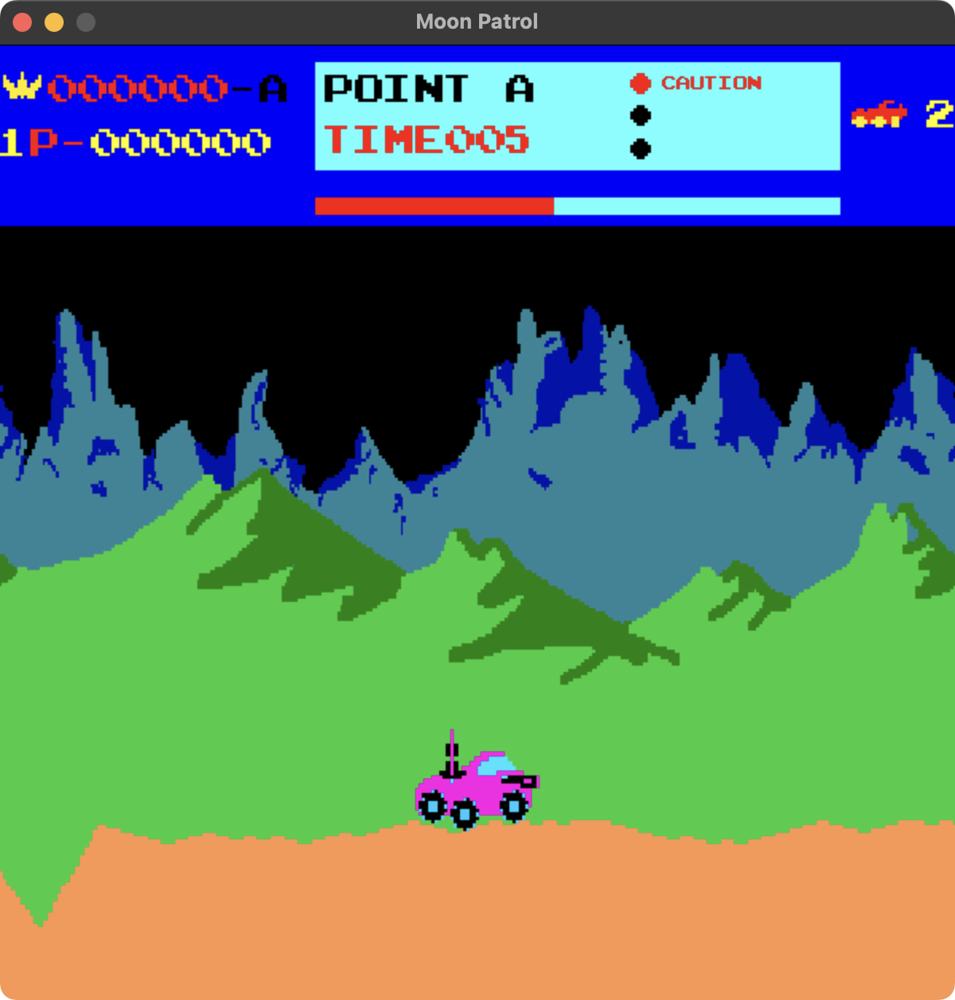

# Moon Patrol

This is a clone of the classic arcade game Moon Patrol. The project is an assignment for a project work course at the University of Applied Sciences in Karlsruhe.
It is written in C++ using the SDL2 library. All assets are recreated by me.

A screenshot of the current state of the game:

## Tools used
- [Piskel](https://www.piskelapp.com/) for creating the pixel art
- [SDL2](https://www.libsdl.org/) for the game engine

## Maintainer

[Julian Aßmann](https://github.com/JulianAssmann)